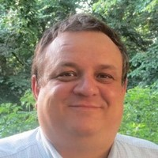

<!-- ## Overview

Executable semantic parsers map natural language utterances to meaning representations that can be executed in a particular context such as databases, knowledge graphs, robotic environment, and software applications. The field has become increasingly important as it allows users to seek information and control computer systems naturally and flexibly via interactive exchanges in natural language. We envision that practical semantic parsing systems need to be equipped with three core capabilities: 

- Understanding user utterances in context and mapping them to executable forms.
- Clarifying ambiguous utterances and providing guidance for user to form valid input.
- Providing a faithful explanation of its interpreted actions for user verification and feedback.

To this end, the problem of mapping well-formed, individual natural language utterances to formal representations has been studied extensively.

In comparison, semantic parsing in an interactive setup has received less attention until very recently. Furthermore, most of existing semantic parsers assume valid input only hence cannot detect ambiguous/invalid utterances and clarify them effectively.
There is also less focus on explainablility and trustworthiness, where the system can explain its interpreted actions to the user for verification and feedback.

This workshop aims to bring together researchers and promote exciting work towards powerful, robust and reliable interactive executable semantic parsing systems. We seek submissions in two tracks:

- A research track for presenting novel contributions relevant but not limited to the directions mentioned above.
- A shared task track on the newly introduced conversational text-to-SQL challenge ([CoSQL](https://yale-lily.github.io/cosql))

<a class="twitter-timeline tw-align-center" data-width="80%" margin="auto" text-align="center" href="https://twitter.com/intexsempar2020?ref_src=twsrc%5Etfw">Tweets by intexsempar2020</a>  -->

## Program Schedule

Thursday Nov 19, 2020 Pacific Time
 
08:15–08:30 &nbsp;&nbsp;&nbsp; Opening Remarks
 
08:30–09:30 &nbsp;&nbsp;&nbsp; Invited Talk: Jacob Andreas
 
09:30–10:30 &nbsp;&nbsp;&nbsp; Invited Talk: Jonathan Berant
 
10:30–10:50 &nbsp;&nbsp;&nbsp; Break
 
10:50–11:00 &nbsp;&nbsp;&nbsp; Learning Adaptive Language Interfaces through Decomposition
 
11:00–11:10 &nbsp;&nbsp;&nbsp; Improving Sequence-to-Sequence Semantic Parser for Task Oriented Dialog
 
11:10–11:20 &nbsp;&nbsp;&nbsp; Uncertainty and Traffic-Aware Active Learning for Semantic Parsing
 
11:20–11:30 &nbsp;&nbsp;&nbsp; Did You Ask a Good Question? A Cross-Domain Question Intention Classification Benchmark for Text-to-SQL
 
11:30–12:30 &nbsp;&nbsp;&nbsp; Invited Talk: Yoav Artzi
 
12:30–13:30 &nbsp;&nbsp;&nbsp; Poster Presentation in gather.town
 
13:30–14:30 &nbsp;&nbsp;&nbsp; Invited Talk: Dilek Hakkani-Tür
 
14:30–14:40 &nbsp;&nbsp;&nbsp; QA2Explanation: Generating and Evaluating Explanations for Question Answering Systems over Knowledge Graph
 
14:40–14:50 &nbsp;&nbsp;&nbsp; ColloQL: Robust Text-to-SQL Over Search Queries
 
14:50–15:00 &nbsp;&nbsp;&nbsp; GRAPPA: Grammar-Augmented Pre-Training for Table Semantic Parsing
 
15:00–15:10 &nbsp;&nbsp;&nbsp; Beyond I.I.D.: Three Levels of Generalization for Question Answering on Knowledge Bases
 
15:10–15:20 &nbsp;&nbsp;&nbsp; Natural Language Response Generation from SQL with Generalization and Back-translation
 
15:20–15:30 &nbsp;&nbsp;&nbsp; Break
 
15:30–16:30 &nbsp;&nbsp;&nbsp; Invited Talk: Alex Polozov
 
16:30–17:30 &nbsp;&nbsp;&nbsp; Invited Talk: Richard Socher
 
17:30–17:35 &nbsp;&nbsp;&nbsp; Closing remarks

## Invited Speakers

<table>
  <tbody>
    <tr>
      <td width="25%"></td>
      <td width="25%"></td>
      <td width="25%"></td>
      <td width="25%"></td>
    </tr>
    <tr>
      <td><a href="https://yoavartzi.com/">Yoav Artzi (Cornell)</a></td>
      <td><a href="http://www.cs.tau.ac.il/~joberant/">Jonathan Berant (Tel Aviv University/AI2)</a></td>
      <td><a href="https://www.socher.org/">Richard Socher (Salesforce Research)</a></td>
      <td><a href="https://scholar.google.com/citations?user=GMcL_9kAAAAJ&hl=en">Dilek Hakkani-T&uuml;r (Amazon Alexa AI)</a></td>
    </tr>
    <tr>
      <td width="25%"></td>
      <td width="25%"></td>
    </tr>
    <tr>
      <td><a href="https://alexpolozov.com/">Alex Polozov (Microsoft Research)</a></td>
      <td><a href="https://www.mit.edu/~jda/">Jacob Andreas (MIT)</a></td>
    </tr>
  </tbody>
</table>

<!-- - [Yoav Artzi](https://yoavartzi.com/), Cornell University
- [Jonathan Berant](http://www.cs.tau.ac.il/~joberant/), Tel Aviv University/Allen Institute for Artificial Intelligence
- [Richard Socher](https://www.socher.org/), Salesforce Research
- [Dilek Hakkani-T&uuml;r](https://scholar.google.com/citations?user=GMcL_9kAAAAJ&hl=en), Amazon Alexa AI
- [Alex Polozov](https://alexpolozov.com/), Microsoft Research
- [Mirella Lapata](https://homepages.inf.ed.ac.uk/mlap/), The University of Edinburgh -->

## Steering Committee

<table>
  <tbody>
    <tr>
      <td width="25%"></td>
      <td width="25%"></td>
      <td width="25%"></td>
      <td width="25%"></td>
    </tr>
    <tr>
      <td><a href="http://www.cs.tau.ac.il/~joberant/">Jonathan Berant (Tel Aviv University/AI2)</a></td>
      <td><a href="http://www.phontron.com/">Graham Neubig (CMU)</a></td>
      <td><a href="https://researcher.watson.ibm.com/researcher/view.php?person=us-yunyaoli">Yunyao Li (IBM Research)</a></td>
      <td><a href="http://cmxiong.com/">Caiming Xiong (Salesforce Research)</a></td>
    </tr>
    <tr>
      <td width="25%"></td>
      <td width="25%"></td>
    </tr>
    <tr>
      <td><a href="https://www.cs.yale.edu/homes/radev/">Dragomir Radev (Yale University)</a></td>
      <td><a href="https://www.cs.washington.edu/people/faculty/lsz">Luke Zettlemoyer (University of Washington)</a></td>
    </tr>
  </tbody>
</table>
<!-- - [Jonathan Berant](http://www.cs.tau.ac.il/~joberant/), Tel-Aviv University
- [Graham Neubig](http://www.phontron.com/), Carnegie Mellon University
- [Yunyao Li](https://researcher.watson.ibm.com/researcher/view.php?person=us-yunyaoli), IBM Research
- [Caiming Xiong](http://www.stat.ucla.edu/~caiming/), Salesforce Research
- [Dragomir Radev](https://www.cs.yale.edu/homes/radev/), Yale University
- [Luke Zettlemoyer](https://www.cs.washington.edu/people/faculty/lsz), University of Washington -->

## Organizing Committee

<table>
  <tbody>
    <tr>
      <td width="25%"></td>
      <td width="25%"></td>
      <td width="25%"></td>
      <td width="25%"></td>
    </tr>
    <tr>
      <td><a href="https://benbogin.github.io/">Ben Bogin (Tel Aviv University)</a></td>
      <td><a href="http://sriniiyer.github.io/">Srinivasan Iyer (Facebook AI)</a></td>
      <td><a href="http://victorialin.net/">Victoria Lin (Salesforce Research)</a></td>
      <td><a href="http://alanesuhr.com/">Alane Suhr (Cornell University)</a></td>
    </tr>
    <tr>
      <td width="25%"></td>
      <td width="25%"></td>
      <td width="25%"></td>
      <td width="25%"></td>
    </tr>
    <tr>
      <td><a href="https://ppasupat.github.io/">Panupong (Ice) Pasupat (Google)</a></td>
      <td><a href="http://pcyin.me/">Pengcheng Yin (CMU)</a></td>
      <td><a href="https://taoyds.github.io/">Tao Yu (Yale University)</a></td>
      <td><a href="https://ryanzhumich.github.io/">Rui Zhang (Penn State University)</a></td>
    </tr>
    <tr>
      <td width="25%"></td>
    </tr>
    <tr>
      <td><a href="https://www.victorzhong.com/">Victor Zhong (University of Washington)</a></td>
    </tr>
  </tbody>
</table>
<!-- - [Ben Bogin](https://benbogin.github.io/), Tel Aviv University 
- [Srinivasan Iyer](http://sriniiyer.github.io/), University of Washington
- [Victoria Lin](http://victorialin.net/), Salesforce Research
- [Alane Suhr](http://alanesuhr.com/), Cornell University
- [Panupong (Ice) Pasupat](https://ppasupat.github.io/), Google
- [Pengcheng Yin](http://pcyin.me/), Carnegie Mellon University
- [Tao Yu](https://taoyds.github.io/), Yale University
- [Rui Zhang](https://ryanzhumich.github.io/), Yale University -> Penn State University
- [Victor Zhong](https://www.victorzhong.com/), University of Washington -->

## Sponsors

